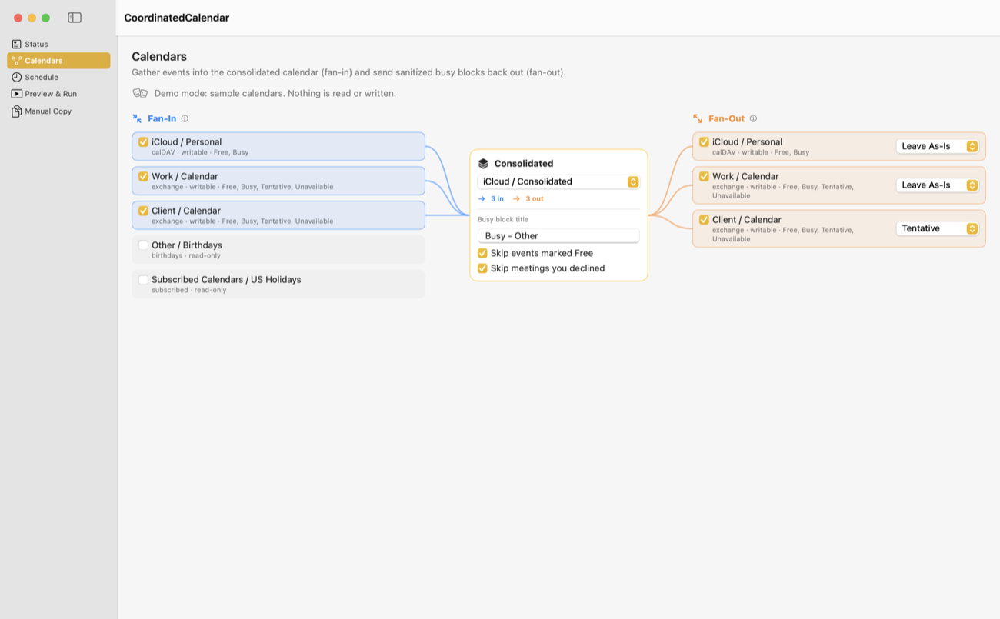
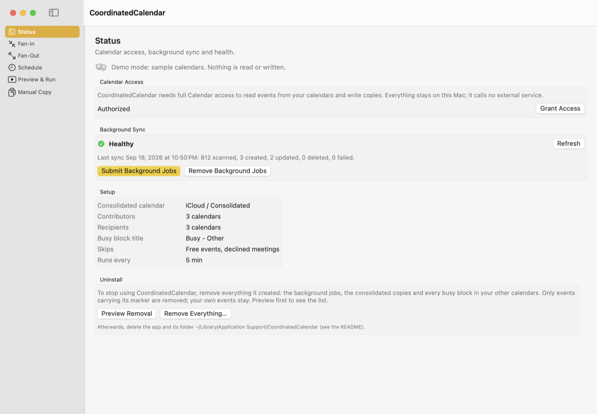
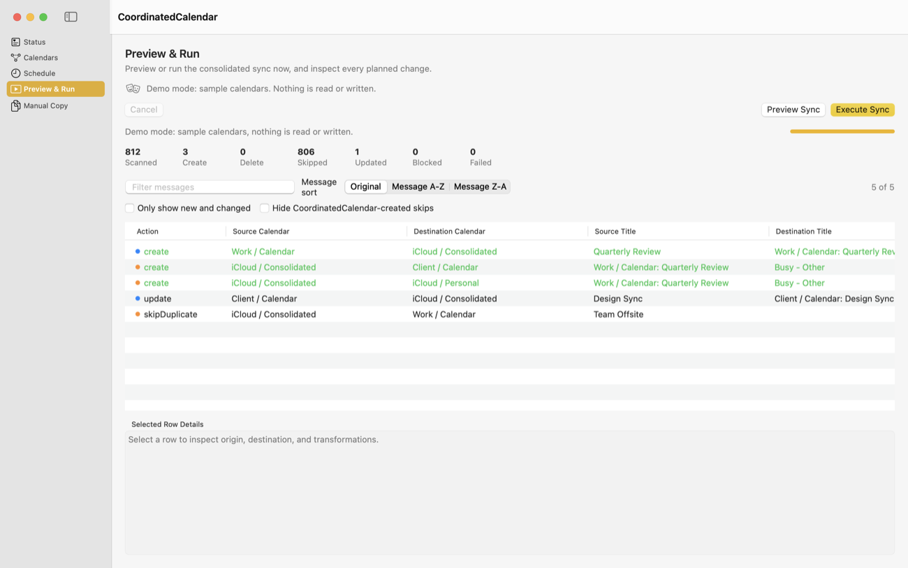

# CoordinatedCalendar

CoordinatedCalendar helps people who juggle calendars across several accounts, such as a work Exchange calendar, a client's calendar and a personal iCloud calendar, keep their free/busy time coordinated. When you're busy on Calendar B, Calendar A shows a matching busy block. The block is sanitized to prevent cross-contamination: no event title, attendees, location, link or notes pass from one account to another.

To do that, it gathers every event into one consolidated calendar you choose, which keeps the full details for your own use. From there it copies plain busy blocks (titled `Busy - Other` unless you choose another title) back out to each of the other calendars. It is a local macOS app built on SwiftUI and EventKit. Its bookkeeping stays in local Application Support storage, and nothing about your calendars ever leaves the Mac. The one network request it can make is an update check: when you click **Check for Updates** (and once a week while the app is open, unless you turn that off), it asks GitHub for the latest release number.

**No API connections or sign-ins of its own.** CoordinatedCalendar does not connect to Google, Microsoft, iCloud or any other service. It has no OAuth app, API keys or stored passwords. It reads and writes calendars only through the Calendar app built into macOS, using the accounts you already added in **System Settings > Internet Accounts**. Syncing with each provider, expired credentials and re-authentication are all handled by macOS with Apple's own account connections. When an account needs you to sign in again, macOS prompts you as usual, and CoordinatedCalendar picks up where it left off. Because it never asks a provider for access itself, it works with any account the built-in Calendar app can use, including Exchange and Microsoft 365 accounts whose organizations allow the Mac's Calendar app but not third-party calendar services.

## What It Does

- Requests macOS Calendar full access with an explicit privacy explanation.
- Lists calendars with source-qualified identities such as `iCloud / Work`.
- **Fan-in:** copies every event from your selected contributor calendars into one consolidated calendar with full details, titled `Calendar: Title` (for example `Work / Calendar: Design Review`). The consolidated calendar is your single, complete view across all accounts.
- **Fan-out:** copies each consolidated event back to your other writable calendars as a sanitized free/busy block. The block has only a busy title (`Busy - Other` by default, or your own), its times and availability, the private flag where supported, and a CoordinatedCalendar marker in the notes. It never carries alarms, location, URL, attendees or other notes. The marker is encoded JSON holding only hashes and the free/busy status: copy and source IDs, the copy's fingerprint, and the calendars involved, each stored as a one-way hash of its name. Decoding it reveals no event content and no calendar or account names. An event is never copied back to the calendar it came from. By default, events marked Free and meetings you declined get no busy block, since they don't take up your time; either can be turned back on.
- Keeps both directions current: new, changed and deleted source events are reflected on the next run. A scheduled background job runs fan-in and then fan-out every few minutes (see [Automatic Runs](#automatic-runs)).
- Adapts each copy to what its destination calendar supports, such as Exchange's Tentative status versus iCloud's Free/Busy only (see [Calendars With Different Capabilities](#calendars-with-different-capabilities)).
- Also copies events within a date window from one source calendar to one writable destination calendar on request (`--copy`), with full details or as free/busy blocks.
- Full-detail copies preserve title, dates, all-day status, timezone, location (including structured-location coordinates and radius), notes and URL where EventKit permits. Alerts are left off consolidated copies unless asked for (`--keep-alerts`, or the setting in the app), and busy blocks never carry any. Each occurrence of a recurring event is copied as its own event, without recurrence rules. EventKit cannot write attendees, organizer or status onto a copy, so full-detail copies add a `Source details:` block to their notes (status when tentative or canceled, organizer, up to 50 attendees with their responses, and a plain-language repeat rule), placed before the CoordinatedCalendar marker.
- Supports title prefix/suffix, notes footer, and field-copy toggles.
- Defaults to dry-run preview before writing.
- Prevents duplicate copies with a durable mapping ledger and deterministic fingerprints.
- Handles incremental reruns. Existing copies are skipped unless update mode is enabled.

## Screenshots

These use the app's demo mode (`-demoMode YES`), which shows sample calendars and never reads or writes anything.

The **Calendars** page shows fan-in and fan-out side by side: checked contributors on the left curve into the consolidated calendar in the middle, which fans out to the checked recipients on the right.



| Status | Preview & Run |
|---|---|
|  |  |

## Requirements

- macOS 14 (Sonoma) or later, on a Mac with Apple silicon that is on and awake when you want syncing to happen. (Intel Macs can build it from source.)
- To build it yourself instead of downloading it: the Swift 6.1 toolchain or later, from Xcode 16.4 or later or the Xcode Command Line Tools (`xcode-select --install`).
- Your calendar accounts added in **System Settings > Internet Accounts** (or in the Calendar app), so they appear in Calendar.

## Install

### Download

1. Download `CoordinatedCalendar-<version>.dmg` from the [latest release](https://github.com/Tinleg/CoordinatedCalendar/releases/latest) and open it.
2. Drag **CoordinatedCalendar** onto **Applications**.
3. Open it from Applications. The first time, macOS says it can't check the app for malicious software, because the app isn't notarized by Apple. Click **Done** (not Move to Trash), then open **System Settings > Privacy & Security**, scroll to the message about CoordinatedCalendar and click **Open Anyway**, and confirm. You only do this once; updates signed by the same developer open normally. (On macOS 14 you can instead right-click the app, choose **Open**, and confirm.)

Each release lists the disk image's SHA-256 checksum. To check your download: `shasum -a 256 ~/Downloads/CoordinatedCalendar-<version>.dmg`.

Keep the app in Applications: background syncing refuses to run from Downloads or the disk image, because that copy would move or disappear. The app checks weekly for a newer version (it can be turned off); to update, download the new disk image and replace the app. Settings, the Calendar permission and background jobs carry over.

### Build from source

```bash
git clone https://github.com/Tinleg/CoordinatedCalendar.git
cd CoordinatedCalendar
./scripts/verify-on-mac.sh
open ~/Applications/CoordinatedCalendar.app
```

`verify-on-mac.sh` runs the tests, builds a release binary and installs the app at `~/Applications/CoordinatedCalendar.app` (override with `COORDINATEDCALENDAR_APP_DIR`), with `.build/CoordinatedCalendar.app` as a symlink to it. Packaging waits for a running scheduled sync to finish and swaps the new bundle in whole, so it is safe to redeploy while the background job is installed.

You don't need an Apple developer account. The app is signed with your own code-signing identity if you have one; otherwise it is ad-hoc signed (see [Calendar Permission Stability](#calendar-permission-stability)). Because you built it yourself, macOS does not show the downloaded-app warning.

### Calendar access

The first time the app reads your calendars, macOS asks for Calendar access: choose **Allow Full Access**. CoordinatedCalendar needs to read every calendar and write copies and busy blocks. The first time it posts a health notification, macOS may ask whether to allow notifications. The access prompt comes up again only if the app's signing identity changes.

## Suggested Setup

1. **Create a consolidation calendar.** In the Calendar app, add a new calendar under any account, for example **File > New Calendar**, named `Consolidated`. Any writable account works. iCloud is a good choice because the full consolidated view then syncs to all your Apple devices, but the calendar holds full meeting details from every account, so pick an account where that is acceptable (see [What the consolidated calendar holds](#what-the-consolidated-calendar-holds)). Reserve it for CoordinatedCalendar: events you add to it directly are treated as your own and fan out as busy blocks too.
2. **Install CoordinatedCalendar** (see [Install](#install)), open it and click **Grant Access** to give it full Calendar access.
3. **Set up the pages in the sidebar.**
   - **Calendars:** in the middle card, choose the **Consolidated** calendar you just created, then set the **Busy block title** (default `Busy - Other`), whether gathered events keep their alerts (off by default) and whether to skip events marked Free and meetings you declined (both on by default). Hover over any of them for an explanation.
     - On the left (**Fan-In**), check every calendar whose events should be gathered.
     - On the right (**Fan-Out**), check every calendar that should receive busy blocks, usually the same writable calendars. For each one, the availability picker keeps the source status (**Leave As-Is**) or forces Free, Busy or Tentative, limited to what that calendar supports.
     - Each calendar's row shows its account type, whether it's writable, and the statuses it supports. Curves show where events flow.
   - **Schedule:** choose how often the background sync runs, and the **Date Window** to keep in sync, as days back and days ahead of today. The window moves forward a day each day; copies of events that fall out of it are left as they are and no longer updated.
4. **Preview first.** On **Preview & Run**, click **Preview Sync** and check the planned copies before anything is written.
5. **Click Submit Background Jobs** on the **Status** page. This installs the scheduled sync and the health check (see [Automatic Runs](#automatic-runs)). From then on, fan-in and fan-out run every few minutes without the app open.
6. **Check it's healthy.** The **Status** page shows the last sync and any problems, or run `~/Applications/CoordinatedCalendar.app/Contents/MacOS/CoordinatedCalendar --health-check`. Calendar choices, the busy block title and the skip settings apply on the next run. After changing the interval or date window, submit the background jobs again.

The **Manual Copy** page copies events once from one calendar to another, with its own field options, outside the scheduled sync.

Leave read-only calendars such as holidays, birthdays and subscriptions out of the recipients. They can still be contributors.

### What the consolidated calendar holds

The consolidated calendar is your private, complete view, and it keeps full, readable details for every event it gathers:

- **Title:** the source calendar and the original title, such as `Work / Calendar: Quarterly Review`.
- **Location:** the original location text, plus map coordinates when the source event has them.
- **Notes:** the original notes in full, which for online meetings usually include join links, meeting IDs and passcodes. After them comes a `Source details:` block with the organizer and attendees (names, email addresses and responses), a tentative or canceled status, and the repeat rule.
- **Also:** the URL and free/busy status. **Not alerts:** a gathered copy carries none, so a meeting doesn't notify you again from the consolidated calendar; the original event still alerts as it always did. Turn on **Keep alerts on gathered events** in the Calendars page to copy them after all.

Only the last line of the notes, the CoordinatedCalendar marker, is encoded. In the consolidated calendar it also names the source event and its calendar in the clear, so tools that read your hub can tell exactly which event a copy came from. The busy blocks on your other calendars carry none of these details: their markers hold nothing but hashes, and a busy block found naming its source is stripped on the next run.

Keep this in mind when choosing where the consolidated calendar lives and whom you share it with. Anyone who can see it can read all of it, including meeting passcodes and attendee addresses. That includes a person you share it with, and the provider of the account that hosts it. If an employer restricts copying meeting details into personal accounts, host the consolidated calendar under that work account instead. Consolidated Sync, in the GUI and the scheduled job, always copies full details. To gather less, run `--fan-in` from the command line with `--no-notes`, `--no-location` or `--no-url`. `--no-notes` drops the original notes, but the `Source details:` block with organizer and attendees is still added.

## Running On More Than One Mac

CoordinatedCalendar can run on several Macs signed in to the same accounts without duplicating events across calendars. Every copy it writes carries a marker in its notes with a copy ID derived from the source event's cross-device identifier and the calendar names. A Mac that finds a copy another Mac already made, once the calendars have synced, skips it or updates it instead of creating a second one. It also recognizes the other Mac's copies when fanning out and when cleaning up after deleted events. The local ledger (`mappings.json`) is only a per-Mac cache.

For this to hold:

- Keep account and calendar names the same on every Mac (**Calendar > Settings > Accounts** can rename them per Mac), because the names are part of the copy ID.
- Point every Mac at the same consolidated calendar and the same contributors and recipients.
- If two Macs pick up a brand-new event before their calendars have synced, each can create a copy. CoordinatedCalendar removes the extra automatically on its next run, once the copies have synced. Copies of the same source event share a copy ID, and every Mac keeps the same one: the earliest created, with ties broken by the event's cross-device identifier. This check only ever considers CoordinatedCalendar's own copies.

## If Calendar Is Missing Events

If an Exchange or Microsoft 365 calendar shows events on the web that the Mac's Calendar app does not — often recurring meetings — the Mac's local copy of that account has fallen behind. `--list-events` confirms it from the Mac's side. The usual fix is **System Settings → Internet Accounts → that account → turn Calendars off, wait a minute, turn it back on**, which re-downloads everything.

Two things to do around it:

1. **Pause syncing first**: on the Status page, **Remove Background Jobs**. While the account is off, its events briefly vanish, and a sync in that gap would treat them all as deleted.
2. **Resume afterwards** with **Submit Background Jobs**. macOS gives a re-added account's calendars new identifiers; the app notices the calendar came back under the same name, re-attaches it with its settings, and says so at the top of the Status page. Preview a sync first if you want to see what it will do.

The app handles the rest: macOS also regenerates the events' identifiers, and existing copies are re-linked to them in place rather than deleted and recreated.

## Updates

The Status page shows the installed version and has a **Check for Updates** button. It asks GitHub's public releases API for the newest version number and, if there is a newer one, offers a button that opens its download page; nothing is downloaded or installed automatically. **Check automatically once a week** is on by default and can be turned off there; it runs only while the app window is open, never from the background jobs. The same check is available as `--check-for-updates`. The request sends only the app's name and version (as its User-Agent), and nothing about your calendars.

## Reporting a Problem

Open an issue on GitHub and paste in a diagnostics report: **Status page → Copy Diagnostics**, or `--diagnostics` from Terminal. It includes versions, how your calendars are set up and recent sync results, with calendar and account names replaced by labels and event titles removed. Read it before you post it; nothing is sent anywhere unless you paste it.

## Script Mode

Use the packaged app binary for automation so macOS Calendar permission stays attached to the same bundle identity:

```bash
.build/CoordinatedCalendar.app/Contents/MacOS/CoordinatedCalendar --list-calendars
```

See exactly what EventKit hands the app for one calendar, with the identifiers each copy's identity is built from. It is read-only, and is the first thing to run when a calendar seems to be missing events:

```bash
.build/CoordinatedCalendar.app/Contents/MacOS/CoordinatedCalendar --list-events --from "Work / Calendar" --start 2026-09-01 --end 2026-10-01
```

Copy one calendar to another as a dry run:

```bash
.build/CoordinatedCalendar.app/Contents/MacOS/CoordinatedCalendar \
  --copy \
  --from "Work / Calendar" \
  --to "iCloud / Consolidated" \
  --start 2026-09-01 \
  --end 2026-12-31
```

Execute the copy:

```bash
.build/CoordinatedCalendar.app/Contents/MacOS/CoordinatedCalendar \
  --copy \
  --from "Work / Calendar" \
  --to "iCloud / Consolidated" \
  --start 2026-09-01 \
  --end 2026-12-31 \
  --execute
```

Copy as free/busy blocks only:

```bash
.build/CoordinatedCalendar.app/Contents/MacOS/CoordinatedCalendar \
  --copy \
  --from "iCloud / Consolidated" \
  --to "Work / Calendar" \
  --free-busy \
  --busy-title "Busy" \
  --execute
```

Delete destination copies for source events in a date window. This only deletes destination events that CoordinatedCalendar previously mapped from the selected source calendar:

```bash
.build/CoordinatedCalendar.app/Contents/MacOS/CoordinatedCalendar \
  --delete \
  --from "Work / Calendar" \
  --to "iCloud / Consolidated" \
  --start 2026-09-01 \
  --end 2026-12-31
```

Add `--execute` to actually remove those destination events and clear their ledger mappings:

```bash
.build/CoordinatedCalendar.app/Contents/MacOS/CoordinatedCalendar \
  --delete \
  --from "Work / Calendar" \
  --to "iCloud / Consolidated" \
  --start 2026-09-01 \
  --end 2026-12-31 \
  --execute
```

Run the full bridge cycle:

```bash
.build/CoordinatedCalendar.app/Contents/MacOS/CoordinatedCalendar \
  --cycle \
  --consolidated "iCloud / Consolidated" \
  --execute \
  --update \
  --reconcile-deletions \
  --window-days-past 30 \
  --window-days-future 365 \
  --exclude "Personal / Birthdays" \
  --exclude "Work / Birthdays"
```

The cycle does two passes:

- Fan-in: all calendars copy full details into the consolidated calendar, skipping events CoordinatedCalendar created in prior runs.
- Fan-in titles are written as `Calendar: Title`, such as `Work / Calendar: Design Review`.
- Fan-out: the consolidated calendar copies back to other writable calendars as free/busy blocks. A fan-out copy carries only its busy title (`Busy - Other` unless set with `--busy-title` or in the app), its times and availability, the private flag where supported, and the CoordinatedCalendar notes marker. It has no alarms, location, URL, other notes, or recurrence. Every fan-out run also strips existing CoordinatedCalendar fan-out copies back to that, and replaces recurring copies with single occurrences. Only events carrying CoordinatedCalendar's own marker are touched. `--origin-title` does not apply to fan-out.
- Fan-out skips events marked Free and meetings you declined, and removes busy blocks it made for them earlier. Pass `--include-free` or `--include-declined` to keep them. Fan-in records a declined meeting as `Your response: declined` in the consolidated copy's notes, so fan-out can tell.
- Fan-out never sends a busy block back to the calendar an event came from. A meeting that fanned in from `Work / Calendar` is not blocked out again on `Work / Calendar`. CoordinatedCalendar knows each consolidated event's original calendar from its own records and the event's notes marker, so renaming the event's title does not change this.
- With `--reconcile-deletions`, mapped destination copies are deleted when their source event no longer exists in the active date window.

Without `--execute`, every command is a dry run.

Run the consolidated sync using the selections saved by the GUI:

```bash
.build/CoordinatedCalendar.app/Contents/MacOS/CoordinatedCalendar \
  --sync-gui-settings \
  --execute
```

This reads `~/Library/Application Support/CoordinatedCalendar/gui-settings.json`, including the consolidated calendar, contributor calendars, recipient calendars, and selected date window. To test it without writing changes, omit `--execute`.

You can also point at a specific settings file:

```bash
.build/CoordinatedCalendar.app/Contents/MacOS/CoordinatedCalendar \
  --sync-gui-settings \
  --gui-settings "/path/to/gui-settings.json" \
  --execute
```

CoordinatedCalendar writes a compact metadata marker to events it creates so another Mac signed into the same calendars can recognize copies even when its local `mappings.json` ledger is empty. The marker is used to prevent duplicate copies, skip fan-out back to the originating calendar, and reconcile stale copies across computers.

## Calendars With Different Capabilities

Calendars from different account types support different features, and a consolidated setup usually mixes them. CoordinatedCalendar asks EventKit what each calendar supports and adapts each copy to its destination, instead of assuming every calendar behaves the same way.

List what your calendars support:

```bash
.build/CoordinatedCalendar.app/Contents/MacOS/CoordinatedCalendar --list-calendars
```

Each line shows whether the calendar is writable, its account type, and the availability values it accepts. Typical results:

| Account type | Availability values | Can be a destination |
|---|---|---|
| Exchange / Microsoft 365 | Free, Busy, Tentative, Unavailable | Yes |
| iCloud and other CalDAV | Free, Busy | Yes |
| Subscribed, Birthdays | n/a | No (read-only, source only) |

What EventKit reports is authoritative. Use `--list-calendars` rather than this table.

### Availability (free/busy status)

Every copy has a target availability. It is `preserve` (keep the source event's status) or a fixed Free, Busy or Tentative, set with `--availability` or the per-calendar picker in the GUI.

- **The destination supports the target:** CoordinatedCalendar writes it.
- **The destination does not support it** (for example Tentative or Unavailable into an iCloud calendar): CoordinatedCalendar leaves the copy's availability unset rather than guessing. The calendar applies its own default, which is Busy on iCloud. Previews show this as "Not written".
- **The intended value is never lost.** The CoordinatedCalendar notes marker on every copy records the source's availability and the intended availability, even when the calendar could not store them. With `preserve`, later passes read the marker before the event's own availability.

A round trip through a consolidated iCloud calendar therefore keeps Exchange-only statuses:

1. A Tentative meeting on an Exchange work calendar fans in to the iCloud consolidated calendar. iCloud cannot store Tentative, so the copy shows Busy, and its marker records `tentative`.
2. The consolidated event fans out with `preserve`. On another Exchange calendar the busy block is written as **Tentative**, taken from the marker. On an iCloud calendar it stays Busy, the closest status that calendar can hold.

The GUI only offers availability choices a recipient calendar supports. A saved choice the calendar no longer supports falls back to `preserve`. The CLI accepts any value, and one the destination cannot store is simply not written, as above.

Because the resolved availability is part of each copy's fingerprint, a status change at the source, including one carried only in the marker, updates the copies on the next run.

### Other per-account differences

- **Private flag:** free/busy copies are marked private only when EventKit reports that the destination event allows privacy changes. Elsewhere the flag is skipped, and the copy still carries only its busy title and times.
- **Default alerts:** some accounts add their default alert to newly created events. Copies must not alert, so every run removes alerts from CoordinatedCalendar's own copies — busy blocks always, consolidated copies unless **Keep alerts on gathered events** is on — whatever the account added.
- **Read-only fields:** EventKit cannot write attendees, organizer or meeting status on any account type. Full-detail copies carry them in a `Source details:` notes block instead.
- **Recurrence:** accounts expand recurring series differently, so CoordinatedCalendar copies each occurrence as its own event and never writes recurrence rules. A rule on a copied occurrence would expand into phantom events on the destination.
- **Read-only calendars:** subscribed and birthday calendars can be fan-in sources but are never fan-out targets, and `--copy` refuses them as destinations.
- **Date range:** EventKit returns at most four years of events per query on every account type. CoordinatedCalendar fetches long windows in one-year slices so nothing past four years is silently dropped.

## Automatic Runs

Install the scheduled sync from the installed app. This works either from the GUI's submit-background-jobs button or from Terminal:

```bash
~/Applications/CoordinatedCalendar.app/Contents/MacOS/CoordinatedCalendar --install-sync-agent
```

This replaces every existing `io.github.tinleg.coordinatedcalendar.*` LaunchAgent with two agents:

- `io.github.tinleg.coordinatedcalendar.sync` runs `--sync-gui-settings --execute` at the shortest interval saved in the GUI (default 300 seconds), over a rolling window derived from the GUI's saved dates. All fan-ins run first, then all fan-outs, inside one process, so runs never overlap.
- `io.github.tinleg.coordinatedcalendar.health` runs `--health-check --notify` every 15 minutes. It posts a macOS notification when the last sync is older than four intervals or had failures, repeats every 6 hours while the problem persists, and posts once when the sync recovers.

Installing refuses to run from a temporary location such as `/private/tmp`, which macOS clears on restart.

Check health by hand:

```bash
~/Applications/CoordinatedCalendar.app/Contents/MacOS/CoordinatedCalendar --health-check
```

Each scheduled run records its outcome in `~/Library/Application Support/CoordinatedCalendar/last-sync.json`. Logs are written to:

```text
~/Library/Logs/io.github.tinleg.coordinatedcalendar.sync.log
~/Library/Logs/io.github.tinleg.coordinatedcalendar.sync.err.log
```

Errors always go to the `.err.log`. Add `--verbose` to any sync command to also list each create, update, delete and blocked action.

The GUI's remove-background-jobs button unloads and deletes all CoordinatedCalendar LaunchAgents. The older `--install-agent` command still writes a single `--cycle` agent without loading it.

## Calendar Permission Stability

macOS stores Calendar permission against the app identity. Grant access from the packaged `CoordinatedCalendar.app`, then run scripts through that app bundle's executable path. Do not switch between random build products and copied app bundles.

For the most stable local identity across rebuilds, sign with a stable local identity. `scripts/package-app.sh` automatically prefers:

1. `COORDINATEDCALENDAR_SIGN_IDENTITY` when set.
2. A `CoordinatedCalendar Local` identity when present.
3. The first valid local code-signing identity, such as an Apple Development certificate.
4. Ad-hoc signing only when no identity exists.

## Local Data

CoordinatedCalendar keeps its own data in `~/Library/Application Support/CoordinatedCalendar/`:

```text
mappings.json      ledger of which copy belongs to which source event (a per-Mac cache)
gui-settings.json  the calendars and options chosen in the app
last-sync.json     outcome of the last scheduled sync, for the health check
health-alert.json  when the health check last notified you
```

Logs are in `~/Library/Logs/io.github.tinleg.coordinatedcalendar.*.log`. Removing `mappings.json` makes this Mac forget its ledger, but the notes marker still lets it recognize its copies.

## Limitations

- **A Mac has to run it.** Syncing happens only while a Mac with the background job is on, awake and logged in. Changes made while it is asleep are picked up on the next run.
- **Calendar providers add delay.** A copy written on this Mac reaches other devices only when iCloud, Exchange or Google sync it, usually within minutes.
- **Only what macOS Calendar can see.** Accounts must be in the Calendar app. Calendars the Calendar app can't show, or can't write to, can't be sources or destinations respectively.
- **Declined meetings** are detected when your account lists you as an attendee who declined. Some providers remove declined meetings from your calendar instead, in which case there is nothing to skip.
- **Attendees, organizer and status are copied as text** in the notes, because EventKit cannot write them onto a copy.
- **Edit events on their original calendar.** Changes made directly to a copy are overwritten on the next sync, and busy blocks are stripped back to their allowed fields.
- **The date window** is bounded by what you choose in Schedule, fetched in one-year slices.

## Distribution

Releases are built with `scripts/release.sh` (see [Docs/RELEASING.md](Docs/RELEASING.md)): a disk image containing the app signed with the maintainer's Apple Development certificate and the hardened runtime, but not notarized, hence the one-time **Open Anyway** step above. Signing with the same certificate every release is what keeps the Calendar permission across updates.

To distribute your own build without that step, sign with a Developer ID certificate and notarize: `scripts/make-dmg.sh` does both when a "Developer ID Application" certificate is in the keychain and `COORDINATEDCALENDAR_NOTARY_PROFILE` names stored `notarytool` credentials.

## Safety Notes

CoordinatedCalendar only modifies or deletes events it created itself, identified by its ledger or its notes marker. Your own events in a destination calendar are never changed. It deletes a copy when its source event is gone (with `--reconcile-deletions`, on by default for scheduled syncs), removes recurring copies so they can be recreated as single occurrences, and removes duplicate copies of the same source event, keeping one. It does not overwrite previous copies unless updates are enabled (`--update`, or "Allow updates to previous copies" in the GUI). Every command is a dry run until you pass `--execute`, so test with a small date range and a preview before copying a large calendar.

## Uninstall

1. On the **Status** page, click **Preview Removal** to see everything CoordinatedCalendar created, then **Remove Everything…**. This removes the background jobs first, so nothing is recreated. It then deletes every event carrying the app's marker, in every calendar: the consolidated copies and all busy blocks. Your own events, including anything you entered directly in the consolidated calendar, are not touched. From Terminal:

   ```bash
   ~/Applications/CoordinatedCalendar.app/Contents/MacOS/CoordinatedCalendar --remove-all-copies
   ~/Applications/CoordinatedCalendar.app/Contents/MacOS/CoordinatedCalendar --remove-all-copies --execute
   ```

2. Quit the app and delete it and its data:

   ```bash
   rm -rf ~/Applications/CoordinatedCalendar.app
   rm -rf ~/Library/Application\ Support/CoordinatedCalendar
   rm -f ~/Library/Logs/io.github.tinleg.coordinatedcalendar.*
   ```

3. Optionally delete the consolidated calendar in the Calendar app, and remove the app from **System Settings > Privacy & Security > Calendars**.

If you use it on several Macs, remove the background jobs on each (**Remove Background Jobs** on the Status page) before removing everything, so no other Mac recreates copies.

## Documentation

- [Architecture](Docs/ARCHITECTURE.md): how the engine, data model, background jobs and GUI fit together.
- [Design decisions](Docs/DESIGN-DECISIONS.md): the key choices and why they were made.
- [Roadmap](Docs/ROADMAP.md): ideas, known limitations and open questions.
- [Releasing](Docs/RELEASING.md): how versions and releases are made.
- [Changelog](CHANGELOG.md)

## Contributing and Security

Issues and pull requests are welcome. Run `./scripts/verify-on-mac.sh` (or `swift test`) before sending changes; the tests use only synthetic calendars. To report a security or privacy problem, see [SECURITY.md](SECURITY.md).

## License

MIT with the [Commons Clause](https://commonsclause.com/) condition. See [LICENSE](LICENSE).

You may use, copy, modify and share CoordinatedCalendar for free, including for your own work: a consultant can run it on their own calendars. You may not sell it, or sell a product or service (including hosting or paid support) whose value comes entirely or substantially from it. Because of that condition, CoordinatedCalendar is source-available rather than open source in the OSI sense.

Version 0.1.0 was published under the plain MIT license; later versions use MIT with the Commons Clause.

